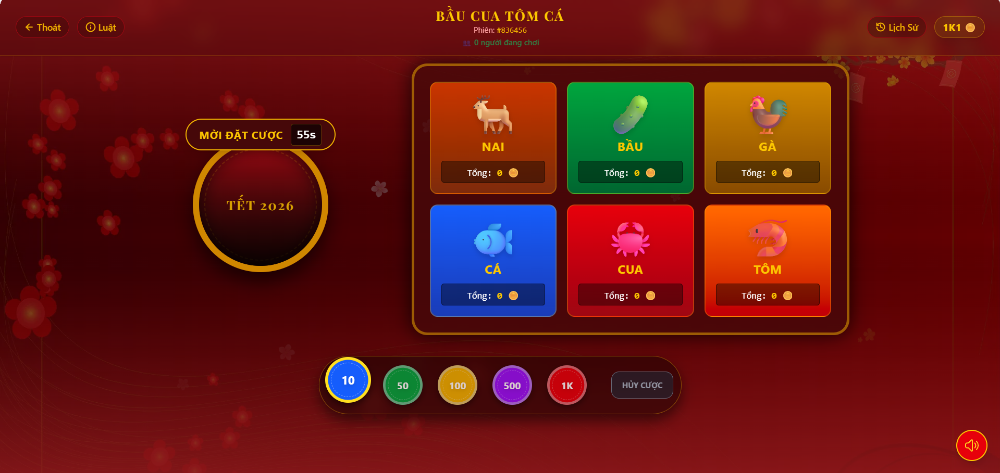
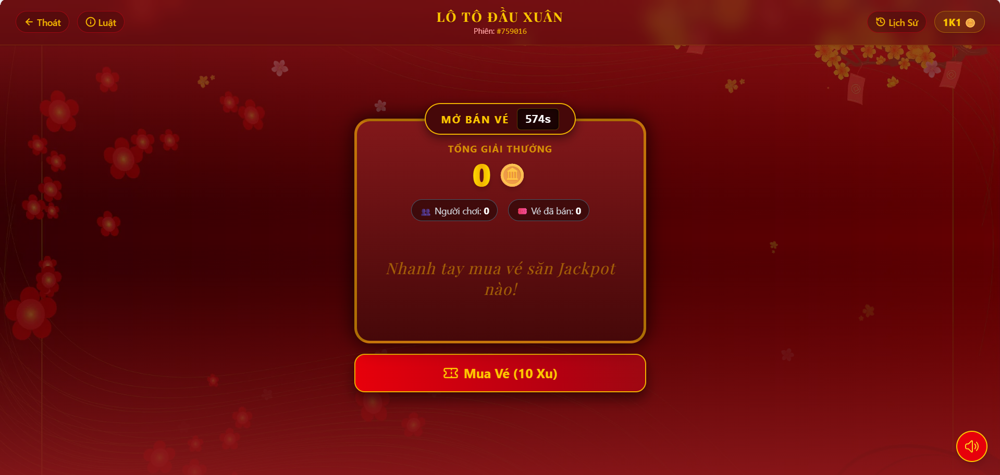
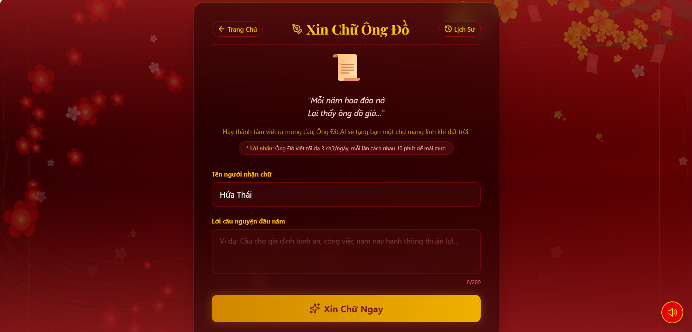

<div align="center">

  <h1>🧧 Tết Countdown & Mini Games System 🎆</h1>
  <h3>Giao diện Web tương tác Real-time Sảnh Game Ngày Tết</h3>

  <p>
    Một ứng dụng Web hiện đại mang không khí Tết truyền thống lên không gian mạng. 
    Hệ thống cung cấp trải nghiệm mượt mà với các sảnh game dân gian (Bầu Cua, Lô Tô) chơi theo thời gian thực nhiều người, kết hợp các hoạt động tương tác độc đáo như Hái Lộc Đầu Xuân và Xin Chữ Ông Đồ.
  </p>

  <p>
    
    
    
    
  </p>

</div>

<br />

# 💻 FRONTEND WEB APPLICATION

Đây là Repository chứa mã nguồn **Frontend**, cung cấp giao diện tương tác trực quan, hiệu ứng sống động và kết nối WebSockets thời gian thực dành cho người chơi.

## 🛠️ Công nghệ & Phiên bản

Dự án được xây dựng với các công nghệ hiện đại trong hệ sinh thái React/Next.js:

### 🏗️ Core Stack

| Công nghệ | Phiên bản | Vai trò |
|------------|------------|------------|
| **[Next.js](https://nextjs.org/)** | 16.1.6 | Framework React sử dụng App Router, xử lý Layout & Routing |
| **[React](https://react.dev/)** | 19.2.3 | Thư viện UI core, xây dựng giao diện Component-based |
| **[react-dom](https://react.dev/learn/rendering-elements)** | 19.2.3 | Thư viện kết xuất DOM cho React |

---

### 🎨 UI & Styling

| Công nghệ | Phiên bản | Vai trò |
|------------|------------|------------|
| **[Tailwind CSS](https://tailwindcss.com/)** | 4.1.18 | Utility-first CSS framework (Phiên bản v4 mới nhất) |
| **[lucide-react](https://lucide.dev/)** | 0.564.0 | Bộ icon SVG tối giản, sắc nét và tối ưu cho React |

---

### 🌐 Networking & Real-time

| Công nghệ | Phiên bản | Vai trò |
|------------|------------|------------|
| **[Socket.io Client](https://socket.io/)** | 4.8.3 | Kết nối WebSockets, đồng bộ trạng thái Game Real-time |
| **[Axios](https://axios-http.com/)** | 1.13.5 | HTTP Client gọi RESTful API (Lịch sử, Auth, Thông tin User) |

---

### ✨ Animations & Utilities

| Công nghệ | Phiên bản | Vai trò |
|------------|------------|------------|
| **[react-confetti](https://www.npmjs.com/package/react-confetti)** | 6.4.0 | Hiệu ứng pháo giấy nổ tung màn hình khi trúng thưởng/Hái lộc |
| **[@fireworks-js/react](https://fireworks.js.org/)** | 2.10.8 | Hiệu ứng pháo hoa nền động chân thực |
| **[lunar-javascript](https://github.com/6tail/lunar-javascript)** | 1.7.7 | Tính toán Lịch Âm, kiểm tra giờ Giao Thừa & Ngày Tết ở Client |
| **[react-use](https://github.com/streamich/react-use)** | 17.6.0 | Bộ custom hooks đa năng (ví dụ: lấy kích thước màn hình cho Confetti) |

## 🌟 Tính năng giao diện

* **🎲 Sảnh Bầu Cua Tôm Cá (Real-time):**
    * Giao diện bàn cược trực quan với hiệu ứng Glassmorphism (Kính mờ).
    * Đồng bộ đếm ngược, xóc đĩa và hiển thị số lượng người chơi thời gian thực qua WebSockets.
    * Popup tính toán và thông báo Lời/Lỗ tự động cực kỳ bắt mắt.

* **🎟️ Sảnh Lô Tô Đầu Xuân (Real-time):**
    * Thuật toán tự sinh và hiển thị ma trận vé 3x9 chuẩn chỉ.
    * Hiệu ứng "Dạ quang" phát sáng các con số được gọi.
    * Nút "Kinh!" thông minh: Ẩn/Hiện dựa trên thuật toán check hàng ngang tự động.

* **🌳 Hái Lộc & Xin Chữ:**
    * **Hái Lộc:** Giao diện chia 2 cột hiện đại, hiển thị rõ tỷ lệ rơi lộc (Ngày thường/Giao thừa). Hiệu ứng rung rinh lì xì và nổ pháo giấy khi hái trúng.
    * **Xin Chữ:** Giao diện cuộn giấy thư pháp truyền thống, cho phép nhập từ khóa và nhận câu chúc sinh bởi AI.

* **📱 Trải nghiệm người dùng (UX) tối ưu:**
    * Giao diện Responsive 100%, tự động thay đổi Layout linh hoạt trên Mobile và PC.
    * Xử lý triệt để các lỗi Accessibility (Viền trắng focus outline) trên Chrome/Edge.
    * Ngăn chặn hành vi thao tác sai (Anti-spam clicks) và bảo vệ route bằng Middleware.

## 📸 Demo Giao diện

### Sảnh Bầu Cua


### Sảnh Lô Tô


### Hái Lộc


### Xin Chữ


## 🚀 Cài đặt & Khởi chạy

### 1️⃣ Yêu cầu hệ thống (Prerequisites)

Dự án được xây dựng trên **Next.js 16** và **React 19**, yêu cầu môi trường tối thiểu:

* **Node.js:** >= 18.17.0 (Khuyến nghị **v20.x LTS**)  
* **Package Manager:** npm >= 9, yarn, pnpm hoặc bun

### 2️⃣ Clone & Cài đặt Dependencies

```bash
git clone https://github.com/hvt299/Tet-Countdown-Web.git
cd Tet-Countdown-Web
npm install
```

### 3️⃣ Cấu hình môi trường (.env)

Tạo file `.env` tại thư mục gốc của dự án:

```env
NEXT_PUBLIC_API_URL=http://localhost:3001
```

### 4️⃣ Lệnh chạy (Scripts)

```bash
# Chạy môi trường phát triển (Hot Reload)
npm run dev

# Build ra production (Tối ưu hóa)
npm run build

# Chạy bản production
npm run start
```
Sau khi chạy, truy cập giao diện tại:

http://localhost:3000

## 📂 Cấu trúc dự án

```text
src/
├── app/                 # Next.js App Router (Pages & Layouts)
├── components/          # Reusable UI Components
├── lib/                 # API Calls (Axios Service)
└── utils/               # Utilities
```

## 🔗 Kết nối Backend

Dự án Frontend này bắt buộc phải chạy song song với Backend Service (mặc định ở cổng 3001) để các API Authentication và máy chủ Socket.io (Real-time Games) có thể hoạt động.

## 👨‍💻 Author

Developed by **Mr.T (hvt299)**  
GitHub: [https://github.com/hvt299](https://github.com/hvt299)